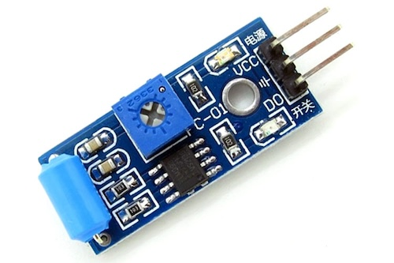
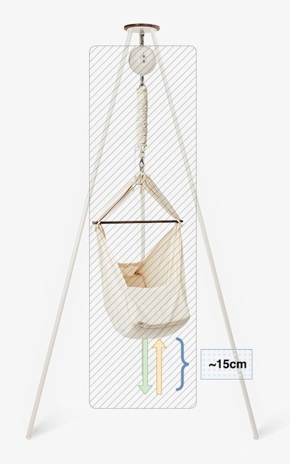

## Giriş

Bir bebeğinizin olması hayatınızda başınıza gelen en güzel şeylerden birisidir. Sürekli olarak gözetim altında tutup uykusunu yemesini ve tuvaletini takip etmeniz gerekir. Her değişikliği bilmek ve anormal olan durumları bilmek hayatı önem taşır. Bebeğin ağlaması, uyuması, emmesi, tuvatini ne renkte ve ne sıklıkta yaptığı her biri gelişiminin nasıl gittiği ile ilgili bize ip uçları veriyor. Bütün bu durumlar için ücretli ve ücretsiz olarak bir çok uygulama mevcut. Bazı insanlar bunları akıllarında tutarak kontrol ediyor ama daha yenilikçi ve teknoloji ile arası iyi olan ebeveynler uygulamalar kullanma seçeğini tercih ediyor. Biz ise (ben ve eşim) uygulama kullanmayı çoğu zaman unuttuğumuz için aklımızda tutmayı denedik ama çoğu zaman başarısız olduk. Son olarak yeni aldığımız otomatik beşikte bebeğin ne kadar uyuduğunu takip etmek bizim için bir sorun olmaya başladı. Bunun nedeni uygulamaları kullanamamızdan ziyade uygulamaya veri girmeyi unutmamızdan kaynaklı.
Kullandığımız beşik aşağıda ki gibidir ve yana sallanmak  yerine yukarı aşağı yönünde sallanmakta.


Üzerinde ki küçük motor beşiği sallamaktadır. İşin gerçeği bu beşik bizi gerçektende çok rahatlattı, bebeğin kolaylıkla uyumasına yardımcı oluyor. Peki bu beşik ile uyku takibi nasıl yapılır? Önceden satın aldığım Arduino ve sensörler ile birşeyler yapabilir miyim diye düşündük ve denemeye karar verdik.

## Denemeler
### Titreşim Sensörü
İlk aklıma gelen beşik eğer hareket ediyorsa bebekte uyuyor mantığından hareket ederek hareket sensörü ile takip etmekti. Bu doğrultuda elimde bulunan bütün sensörleri tek tek araştırdım ve sonunda ihtiyacım olan sensörü buldum.


Neredeyse bütün kitler ile birlikte satılan **sw-420 vibration sensor module** tam aradığım çözümdü benim için. İlk olarak elimde bulunan Arduino Nano ile neler yapabileceğimi görmek için internetten [Arduino Ide](https://www.arduino.cc/en/software) uygulamasını indirip kurdum. Internette yaptığım kısa bir arama sonucunda (ki hatta Arduino Ide içerisinde ki örneklerde de mevcut) basit bir örnek uygulama kodu buldum.

İlk denemelerimde cihaz istediğim gibi çalışıyor ama sürekli olarak farklı sonuçlar gönderiyordu. Bende istenmeyen sonuçları elemek için belli zaman aralıkları ekleyip durum değişikliklerini kontrol etmeye çalıştım. Ama tam olarak istediğim sonucu ne yazık ki alamadım. **Home Assistant** uygulaması ile nasıl entegre edebileceğimi araştırırken **ESPHome** ile bu tarz şeylerin çok daha hızlı ve kolay yapılabileceğini keşfettim.

Ama bir sorun ile daha karşılaştım. Bu cihaz benim ev otomasyonum ile nasıl haberleşecek???
Ev otomasyonuma WIFI üzerinden bilgi göndermesi gerekiyordu ve elimde hiç WIFI modülü yoktu. Kısa bir araştırma sonucunda **ESP328266**'nin bu tarz bir uygulama için uygun bir seçim olduğuna karar verdim. 
Aşağıda bulanacağınız linkten sipariş verip denemelerime kaldığım yerden devam ettim.
* https://www.amazon.de/dp/B0754N794H?ref=ppx_yo2ov_dt_b_product_details&th=1

Hızlı bir şekilde uygulamayı **ESPHome** aracılığı geliştirdim ve takibe başladım. İlk bir kaç kullanımda gerçektende istediğim sonucu verdiğini düşündüm ama sonrasında bu sensörün güvenilmez olduğunun farkına vardım. Bazı durumlarda hareketleri algılamıyor yada hareket olmadığı halde hareket sinyalleri gönderiyordu. Üzerinde ki kalibrasyon ayarı ile düzenleme yapmaya çalışsamda pek başarılı olduğum söylenemez.  Tam bir hayal kırıklığı olduğunu söyleyebilirim.
Ne yazık ki elimde kodları yok ondan dolayıda burada paylaşamıyorum.

### Ultrasonic Sensör

Elimde bulunan diğer sensörleri teker teker inceleyip işime yarayacak bir sensör çıkar mı diye araştırırken **Ultrasonic Sensor HC-SR04** ile denemeler yapmaya karar verdim.


Beşiğin aşağı-yukarı yönünde ki hareketleri algılamak için mesafe ölçümü yapıp, basit bir mantık ile bunu algılamak zor olmasa gerek değil mi?
İlk başlarda herşey basit ve kolay başlado fakat kısa süre sonra ölçümlerde hatalar görünmeye başladı.

Öncelikle aşağıda ki şekli incelersek saniyede beklenen mesafe 15cm ve üzeri ise beşiğimiz hareket ediyor demektir. Ama bir diğer yandan da beşik hiç bir şekilde 50cmden fazla hareket edemez. Buna göre düzenlemeler yaptım.



İlk başlarda ciazı beşiğin altına yerleştirmiktik ama eşimin endişesi dolayısıyla beşiğin orta kısmında ki yatay çubuğun ucuna yerleştirdim. Böylelikle ölçümleri beşiğin dışından yapmaya başladı. Ama bu seferde yerleştirdiğim yerden hareket eden ölçüm cihazı beşiğin hareketsi kaldığını bildirmeye başladı. Bunu çözmek için ise 10 dakikalık bir zaman aşımı ekleyip, eğer beşik 10 dakika içerisinde durup tekrar hareket ederse bunu sadece tek bir zaman dilimi olarak algılayacak şekilde düzenledim. 

İşte burada da **ESPHome** entegrasyon kodu:
```toml
esphome:
  name: baby-bed-move-detector
  friendly_name: baby-bed-move-detector
  
esp8266:
  board: esp01_1m

# Enable logging
logger:
    level: INFO

web_server:
  port: 80
  
# Enable Home Assistant API
api:
  encryption:
    key: "+vWN6Zu+Q9T8Ld9yAhjsesNe0iJMsYT7ZCfWocdBVQM="

ota:
  password: "da2086ea9b66d498385002496346209f"

wifi:
  ssid: !secret wifi_ssid
  password: !secret wifi_password

  # Enable fallback hotspot (captive portal) in case wifi connection fails
  ap:
    ssid: "Baby-Bed-Move-Detector"
    password: "RVc2kXcrHnGg"

captive_portal:

text_sensor:
  - platform: template
    name: "Baby Sleeping"
    id: output_baby_in_cradle
    update_interval: never

  - platform: template
    name: "Sleep Start Time"
    id: sleep_start_time
    update_interval: never

  - platform: template
    name: "Duration"
    id: sleep_duration
    update_interval: never

binary_sensor:
  - platform: template
    name: "Baby Sleeping"
    id: moving
    device_class: motion

time:
  - platform: sntp
    id: sntp_time

sensor:
  - platform: duty_time
    id: sleep_time
    name: Sleep Time
    sensor: moving

  - platform: ultrasonic
    trigger_pin: 0
    echo_pin: 4
    name: distance
    update_interval: 100ms
    unit_of_measurement: cm
    accuracy_decimals: 2
    filters:
      - multiply: 100
      - filter_out: nan
      - sliding_window_moving_average:
          window_size: 100
          send_every: 100
          send_first_at: 100
      
    on_raw_value:
      then:
        lambda: |-
          static auto start_time = id(sntp_time).now();
          static auto  last_start_time     = id(sntp_time).now();
          static bool  has_last_start_time = false;
          static int   start_time_timeout  = 10 * 60; //minutes

          static int   distance_window   = 0;
          static float distance_max      = 0.0;
          static float distance_min      = 0.0;
          static float previous_distance = 0.0;

          static int idle_timeout = 3;
          static int idle_timer   = 0;

          static int sleeping_timeout = 3;
          static int sleeping_timer   = 0;

          /* It is not possible to shake more than 50cm. Discart current value. */
          float is_value_valid = distance_max - distance_min < 0.5;
          if (!is_value_valid) {
            return;
          }
          
          if (distance_window++ > 100)
          {
            distance_window = 0;
            ESP_LOGI("INFO", "The value of sensor is: max: %f min: %f diff: %f", distance_max, distance_min, distance_max - distance_min);

            float is_moving = distance_max - distance_min > 0.1;
            if (is_moving) {

              // Icrease sleeping timer
              sleeping_timer++;

              // Did we wait enough to change status?
              if (sleeping_timer >= sleeping_timeout) {

                // Change status to idle
                id(output_baby_in_cradle).publish_state("Sleeping");
                id(moving).publish_state(true);

                auto now = id(sntp_time).now();

                // Is first time to initialize?
                if (!has_last_start_time) {
                  ESP_LOGI("INFO", "New session started");
                  has_last_start_time = true;
                  last_start_time     = now;
                  start_time          = now;

                } else {
                  // The system had a session but is it expired?
                  bool is_session_expired = now.timestamp - last_start_time.timestamp > start_time_timeout;
                  last_start_time         = now;

                  if (is_session_expired) {
                    ESP_LOGI("INFO", "Session expxired, new session started");
                    start_time = now;
                  } else {
                    ESP_LOGI("INFO", "Session restored or continued");
                  }
                }

                // Current time
                id(sleep_start_time).publish_state(start_time.strftime("%H:%M"));

                time_t duration = (time_t) now.timestamp - start_time.timestamp;
                char duration_as_str[17];
  
                int hours_elapsed = duration / 3600;
                int minutes_elapsed = (duration % 3600) / 60;
                int seconds_elapsed = duration % 60;

                sprintf(duration_as_str, "%02i:%02i:%02i", hours_elapsed, minutes_elapsed, seconds_elapsed);

                // Sleep Duration
                ESP_LOGI("INFO", "Sleep duration: %s", duration_as_str);

                id(sleep_duration).publish_state(duration_as_str);
                
                // Reset all states
                sleeping_timer = 0;
                idle_timer = 0;
                previous_distance = 0.0;
              }

            } else {
              // Icrease idle timer
              idle_timer++;

              // Did we wait enough to change status?
              if (idle_timer >= idle_timeout) {

                // Change status to idle
                id(output_baby_in_cradle).publish_state("Idle");
                id(moving).publish_state(false);

                id(sleep_start_time).publish_state("N/A");
                
                // Reset all states
                sleeping_timer = 0;
                idle_timer = 0;
                previous_distance = 0.0;
              }
            }
          }
          
          if (isnan(x)) {
            x = previous_distance;
          }

          previous_distance = x;

          if (distance_window == 1)
          {
            distance_max = x;
            distance_min = x;
          }
          else
          {
            if (x > distance_max)
            {
              distance_max = x;
            }
            if (x < distance_min)
            {
              distance_min = x;
            }
          }

  - platform: uptime
    name: "Uptime"
  
  - platform: wifi_signal
    name: "WiFi Signal"
    update_interval: 60s
```
Not: Burada titreşim sensörü ve ultrasonik seksör bağlantı şemalarını paylaşmıyorum, internette aratarak kolayca bulabilirsiniz.

**ESPHome** yasesinde sonsuruz bir şekilde **Home Assistant** ile entegrasyon sağladım ve web arayüzü ile anlık olarak debug bilgilerine erişim sağlayabildim.

Tabi bu kadar ilede kalmadı ve başka bir sorun ile karşılaştık. Bu seferde bebek beşiğin içerisinde olduğu halde uyumuyordu :/


### Kamera ile takip
Bir sonra ki adım olarak dedik ki neden kamerayı beşiğin içerisine koyup bebeiğin uykusunu takip etmiyoruz ki? Hem böylelikle gerçek bir veriye ulaşmış oluruz. Saklanmak yada sarsılmalar güzel ama gerçektende bebeğin uyuyup uyumadığı bilgisini bize vermiyor. Bunun yerine sadece dışarıdan en iyi tahmini yapmamızı sağlıyor.

Hemen internete girip **Arduino** ile uyumlu kameraları araştırdım ve **ESP32-CAM** karşıma çıktı. Şiir gibi bir cihaz, hem WIFI var, hem kamera var hemde **ESP32** tabanlı yani **ESP328266** ile bağlantı yapmama gerek yok. Hemen satın aldım. Şurayada linkini bırakayım:
* https://www.amazon.de/dp/B08X3GRK22?psc=1&ref=ppx_yo2ov_dt_b_product_details

Bir kaç gün beklememin ardından ürün elime ulaştı ve hemen ilk denemeleri yapmaya başladım.

Tam bir hayal kırıklığı. Hem görüntü kalitesi kötü, hem çok yavaş hemde karanlık. Beşiğin içerisinde koyduğumda bebeği görmek şöyle dursun herhangibir net görüntü bile alamadım. Onu iade etmek zorunda kaldım.


```python
import hashlib
import os
import base64
from datetime import datetime

username = "admin"
password = "pass"
# created = datetime.now().strftime("%Y-%m-%dT%H:%M:%S.000Z")
created = datetime.utcnow().strftime("%Y-%m-%dT%H:%M:%S.000Z")

raw_nonce = os.urandom(20)
nonce = base64.b64encode(raw_nonce)

sha1 = hashlib.sha1()
sha1.update(raw_nonce + created.encode('utf8') + password.encode('utf8'))
raw_digest = sha1.digest()
digest = base64.b64encode(raw_digest)

template = """<s:Envelope xmlns:s="http://www.w3.org/2003/05/soap-envelope">
    <s:Header>
        <Security s:mustUnderstand="1" xmlns="http://docs.oasis-open.org/wss/2004/01/oasis-200401-wss-wssecurity-secext-1.0.xsd">
            <UsernameToken>
                <Username>{username}</Username>
                <Password Type="http://docs.oasis-open.org/wss/2004/01/oasis-200401-wss-username-token-profile-1.0#PasswordDigest">{digest}</Password>
                <Nonce EncodingType="http://docs.oasis-open.org/wss/2004/01/oasis-200401-wss-soap-message-security-1.0#Base64Binary">{nonce}</Nonce>
                <Created xmlns="http://docs.oasis-open.org/wss/2004/01/oasis-200401-wss-wssecurity-utility-1.0.xsd">{created}</Created>
            </UsernameToken>
        </Security>
    </s:Header>
    <s:Body xmlns:xsi="http://www.w3.org/2001/XMLSchema-instance" xmlns:xsd="http://www.w3.org/2001/XMLSchema">
        <wsdl:GetProfiles/>
    </s:Body>
</s:Envelope>"""

req_body = template.format(username=username, nonce=nonce.decode('utf8'), created=created, digest=digest.decode('utf8'))
print(req_body)


"""
<wsdl:GetStreamUri>
    <wsdl:ProfileToken>PROFILE_001</wsdl:ProfileToken>
</wsdl:GetStreamUri>
"""
```

```bash
python3 onvif.py > request.xml
curl --silent -X POST --header 'Content-Type: text/xml; charset=utf-8' -d @request.xml 'http://192.168.1.222:9000/onvif/device_service' | xmllint --format -
```